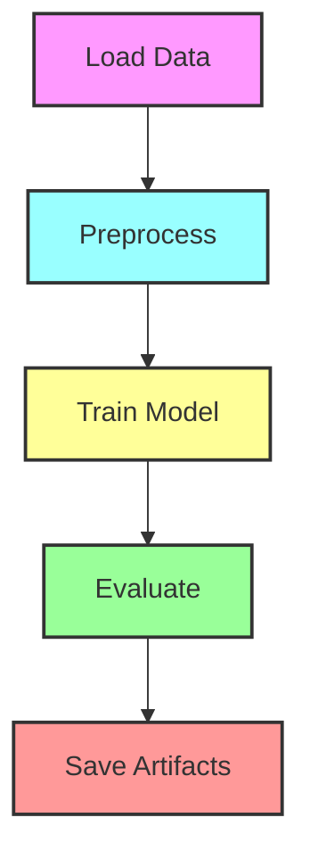

# Breast Cancer Wisconsin Diagnostic Pipeline

## Содержание
1. [Цели проекта](#цели-проекта)  
2. [Описание ML-задачи](#описание-ml-задачи)  
3. [Структура проекта](#структура-проекта)  
4. [Архитектура и схема пайплайна](#архитектура-и-схема-пайплайна)  
5. [Подробное описание этапов](#подробное-описание-этапов)  
    - ETL  
    - Обучение и оценка  
    - Оркестрация (MLOps)  
    - Интеграция и хранение артефактов  
6. [Инструкция по запуску](#инструкция-по-запуску)  
7. [Анализ отказов и устойчивость](#анализ-отказов-и-устойчивость)  
8. [Идеи по улучшению](#идеи-по-улучшению)  

---

## Цели проекта
- **Цель**: построить воспроизводимый ML-пайплайн для задачи бинарной классификации опухолей молочной железы (доброкачественные vs злокачественные) на основе датасета WDBC.  
- **Критерии успеха**:  
  - Логичное разделение на этапы ETL, обучения и оценки;  
  - Автоматизация с помощью Airflow с retries и логированием;  
  - Сохранение артефактов модели и метрик;  
  - Документированный анализ отказов и предложения по развитию.

---

## Описание ML-задачи
- **Тип задачи**: бинарная классификация.  
- **Метрика качества**: F1-score (важен баланс precision/recall).  
- **Данные**: набор из 569 образцов, 30 признаков, цель `diagnosis` (M=1, B=0).  
- **Модель**: логистическая регрессия (`sklearn.linear_model.LogisticRegression`).

---

## Структура проекта
```
breast_cancer_pipeline/
+-- dags/                     # Airflow DAG
¦   L-- pipeline_dag.py
+-- etl/                      # ETL и ML-скрипты
¦   +-- load_data.py
¦   +-- preprocess.py
¦   +-- train_model.py
¦   L-- evaluate.py
+-- etl/data/                 
¦   +-- raw/                  # скачанные сырые CSV
¦   L-- processed/            # нормализованные CSV
+-- results/                  
¦   +-- model/                # сохранённая модель и тестовые выборки
¦   L-- metrics/              # JSON с метриками
+-- logs/                     # логи Airflow
+-- config.yaml               # параметры (пути, URL, S3 и т.д.)
+-- requirements.txt          
L-- README.md                 # эта документация
```

---

## Архитектура и схема пайплайна



- **Load Data**: скачивает CSV по URL.  
- **Preprocess**: удаляет ID, кодирует метки, масштабирует признаки.  
- **Train Model**: разбивает данные, обучает LR, сохраняет `model.pkl`, `X_test.csv`, `y_test.csv`.  
- **Evaluate**: считает accuracy, precision, recall, F1 и сохраняет в JSON.  
- **Save Artifacts**: помещает файлы в `results/`.

---

## Подробное описание этапов

### ETL
1. **load_data.py**  
   - Аргументы: `--url`, `--out_dir`  
   - Скачивает wdbc.data, присваивает названия колонкам и сохраняет `wdbc_raw.csv`.  
2. **preprocess.py**  
   - Аргументы: `--in_dir`, `--out_dir`  
   - Преобразует `M/B > 1/0`, удаляет `id`, масштабирует признаки `StandardScaler`, сохраняет `wdbc_processed.csv`.  

### Обучение и оценка
3. **train_model.py**  
   - Аргументы: `--data_dir`, `--model_dir`  
   - Делит на train/test (80/20, stratify), обучает `LogisticRegression(max_iter=1000)`, сохраняет модель и тестовую выборку.  
4. **evaluate.py**  
   - Аргументы: `--model_dir`, `--out_file`  
   - Загружает модель и `X_test`, `y_test`, вычисляет метрики (`accuracy`, `precision`, `recall`, `f1`), сохраняет JSON.

### Оркестрация (MLOps)
- **Airflow DAG** (`pipeline_dag.py`):
  - **Python/BashOperator** для каждого скрипта.
  - Зависимости: `load_data > preprocess > train_model > evaluate`.
  - `retries=2`, `retry_delay=5m`.
  - `schedule_interval='@daily'`, `catchup=False`.
  - Логи в `logs/breast_cancer_pipeline/...`.

### Интеграция и хранение артефактов
- По умолчанию сохраняем локально в `results/`.
- Для S3 (опционально) — добавить в `config.yaml` раздел `s3:` и скрипт загрузки (`boto3`).

---

## Инструкция по запуску

1. **Активировать окружение**:
   ```bash
   cd /home/ksaga/DE/breast_cancer_pipeline/breast_cancer_pipeline
   python3 -m venv venv
   source venv/bin/activate
   pip install -r requirements.txt
   ```
2. **Ручной запуск**:
   ```bash
   python etl/load_data.py --url <URL> --out_dir etl/data/raw
   python etl/preprocess.py --in_dir etl/data/raw --out_dir etl/data/processed
   python etl/train_model.py --data_dir etl/data/processed --model_dir results/model
   python etl/evaluate.py --model_dir results/model --out_file results/metrics/metrics.json
   ```
3. **Airflow**:
   ```bash
   export AIRFLOW_HOME=~/airflow
   export AIRFLOW__CORE__DAGS_FOLDER=<path_to>/dags
   export AIRFLOW__CORE__LOG_FOLDER=<path_to>/logs

   airflow db init
   airflow scheduler &
   airflow webserver -p 8080

   # тест задачи
   airflow tasks test breast_cancer_pipeline load_data 2025-06-17

   # триггер DAG
   airflow dags trigger breast_cancer_pipeline
   ```

---

## Анализ отказов и устойчивость


| Этап            | Возможная ошибка                               | Обработка / устойчивость                  |
|-----------------|-------------------------------------------------|-------------------------------------------|
| Load Data       | Сеть недоступна, 5xx/4xx                        | `response.raise_for_status()`, retry в Airflow |
| Preprocess      | Неправильная структура CSV, NaN в признаках     | Проверка наличия колонок, `dropna()`      |
| Train Model     | Данные несбалансированы, сходимость не достигнута | `max_iter=1000`, Stratified split, логирование |
| Evaluate        | Пустые `X_test`/`y_test`                        | Проверка размера выборки, ошибки exit      |
| Airflow DAG     | Зависимость сломана                             | `depends_on_past=False`, `catchup=False`  |
| S3 Upload (опц.)| Нет доступа к AWS, неверные креды              | Чтение из `~/.aws/credentials`, логирование |

---

## Идеи по улучшению
- Использовать **MLflow** для трекинга экспериментов и моделей.  
- Расширить метрики: ROC-AUC, PR-AUC, конфузионная матрица.  
- Добавить **Docker** и `docker-compose` для окружения.  
- Реализовать автоматический **веб-сервис** (FastAPI) для онлайн-предсказаний.  
- Интегрировать уведомления (Slack/Email) по событиям из Airflow.  

---
